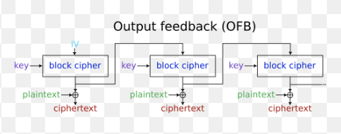

On doit comprendre comme ce code php fonctionne pour que le timestamp ne soit pas expiré et qu'on soit admin au lieu de anonymous:

```php
<?php
if(isset($_GET['token'])) {
	CryptToken::GetInstance()->ParseToken(CryptToken::GetInstance()->Decrypt($_GET['token']));
	if(CryptToken::GetInstance()->TimeStampCheck()) {
		if(CryptToken::GetInstance()->AdminCheck()) {
			ERROR_HANDLE::SetLastError(ERROR_HANDLE::HtmlFlag('Great! Welcome admin FLAG-XXXXXXXXXXXXXXXXXXXXXXXXXX'));
		} else {
			ERROR_HANDLE::SetLastError(ERROR_HANDLE::HtmlError('Your dont have admin privileges. Sorry no flag for you.'));
		}
	} else {
		ERROR_HANDLE::SetLastError(ERROR_HANDLE::HtmlError('Expired timestamp.'));
	}
} else {
	HTTP_HANDLE::Redirect('/challenges/105/?token=' . CryptToken::GetInstance()->Crypt('user=anonymous|ts=' . (time() + 10)));
}
?>
<div class="login_form">
	<div class="title">
	Crypto is not good as you think
	</div>
	<?php echo ERROR_HANDLE::GetLastError();?>
	<div class="download">
		<a href="/files/0deda2ddd4157af5c02c634f1e198e84.txt">Download source code</a>
	</div>
</div>
<?php
// Challenge code
class CryptToken {
	private static $instance;
	private $crypt;
	private $token;
	private $context;
	
	public function __construct() {
		$this->InitCrypt();
	}
	
	private function InitCrypt() {
		$this->crypt = (object)array();
		$this->crypt->key = hash('sha512', 'XXXXXXXXXXXXXXXXXXXXXXXXXXXXXXXXXXXXXX');
	}
	
	public static function GetInstance() {
		if(!isset(self::$instance)) {
			self::$instance = new self();
		}
		return self::$instance;
	}
	
	public function Decrypt($buffer) {
		return
		mcrypt_decrypt(MCRYPT_RIJNDAEL_256,
				pack('H*', substr($this->crypt->key, 0, 64)),
				base64_decode($buffer),
				MCRYPT_MODE_OFB,
				pack('H*', substr($this->crypt->key, -64)));
	}
	
	public function Crypt($buffer) {
		return
		base64_encode(
				mcrypt_encrypt(MCRYPT_RIJNDAEL_256,
						pack('H*', substr($this->crypt->key, 0, 64)),
						$buffer,
						MCRYPT_MODE_OFB,
						pack('H*', substr($this->crypt->key, -64))));		
	}
	
	public function ParseToken($token) {
		$this->token = explode('|', $token);
		$this->ExtractValue();
		return $this;
	}
	
	private function ExtractValue() {
		foreach($this->token as $item) {
			$current = explode('=', $item);
			if(count($current) == 2) {
				$this->context->{$current[0]} = $current[1];
			}
		}
	}
	
	public function TimeStampCheck() {
		if($this->context->ts >= time()) {
			return true;
		}
		return false;
	}
	
	public function AdminCheck() {
		if($this->context->user == 'admin') {
			return true;
		}
		return false;
	}
}
?>
```



Avec OFB, on peut faire ceci:
Ciphertext = Plaintext ⊕ Keystream
Mais on ne connait que le Ciphertext
Cependant, le Plaintext est prévisible car on le voit dans le code: user=anonymous|ts=<un_time_stamp>+10
Or seul le timestamp varie ... 
Si on fait plusieurs essai-erreur dans un range proche du timestamp (cipher xor potentiel plaintext avec timestamp estimé),
On pourra reconstituer un keystream (Keystream = Plaintext ⊕ Ciphertext)
Et ensuite recréer un payload avec cette fois user=admin|ts=<un_time_stamp>+10

Normalement avec quelques essaie de timestamp, on va reçevoir le flag du serveur 

FLAG-p3Ys61l46Z74Z84gSsW0J36E0k