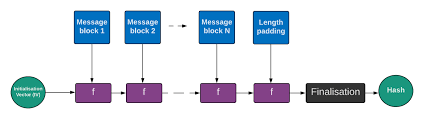

Ne connaissant pas vraiment HMAC, j'ai appris qu'il sert à garantir l'authenticité des messages.

Le client et le serveur partagent une clé secrète K.
Le client envoie un message M et un tag HMAC(K, M).
Le serveur recalcule HMAC(K, M) de son côté.
Si le tag correspond, il sait que le message vient bien de quelqu’un qui connaît K.

Bref:
SHA-1 → intégrité seule (on voit si le contenu a changé).
HMAC-SHA1 → intégrité + authenticité (on voit si le contenu vient du bon expéditeur).

Déjà le token est un hexadécimal donc très facile à lire:
username=guest&timestamp=<un_nombre> 
ce nombre est un timestamp qui va changer à chaque appel.

J'ai d'abord essayé de trouver une clé via un gros dictionnaire ... ça n'a rien donné.

J'ai continué mes recherches pour connaitre les vulnérabilités de HMAC et la technique de length extension attack est apparue.
voir : https://www.youtube.com/watch?v=H_bvdhPMizE

J'ai repris le même outil (hash_extender) que dans la vidéo. Dans notre cas le timestamp change donc il faut re-ssh à chaque taille de clé. N'oubliez pas de l'installer (git clone ...)


# Fonctionnement de hash length extension avec visualisation



## Exemple simple avec des nombres pour montrer le concept de "chaînage des états"
state = 12345  # État initial (IV)
    
for bloc in découper_en_blocs(data): (# exemple de fonction calculant l'état)
    state = (state * 7 + somme(bloc)) % 1000000

return state

Calcul Normal (serveur)
secret = "SECRET"  # imaginons que ça donne 100 en somme
message = "user=guest"  # imaginons 200 en somme

Bloc 1
state = 12345
state = (12345 * 7 + 100 + 200) % 1000000
state = (86415 + 300) % 1000000
state = 86715  ← C'est le hash que vous recevez !


Votre Attaque
Vous commencez avec l'état que le serveur avait (86715) :
state = 86715  # Vous initialisez avec le hash reçu !


Vous ajoutez votre nouveau bloc
nouveau = "&admin=true"  # imaginons 150 en somme

state = (86715 * 7 + 150) % 1000000
state = (607005 + 150) % 1000000
state = 607155  ← Votre nouveau hash !

Vérification serveur:
secret = "SECRET"  # 100
message = "user=guest"  # 200
padding = [padding calculé]
nouveau = "&admin=true"  # 150

Bloc 1
state = 12345
state = (12345 * 7 + 100 + 200) % 1000000
state = 86715  ← État intermédiaire (votre point de départ !)

Bloc 2 (votre extension)
state = (86715 * 7 + 150) % 1000000
state = 607155  ← Même résultat que vous ! ✅
```

**Les hashs correspondent** car vous avez continué **exactement** où le serveur s'était arrêté !

---

## 📊 Visualisation Étape par Étape
```
CE QUE LE SERVEUR FAIT (calcul original):
┌─────────┐
│ h=12345 │ État initial
└─────────┘
     ↓ [traite "SECRET"]
┌─────────┐
│ h=23456 │
└─────────┘
     ↓ [traite "username=guest"]
┌─────────┐
│ h=86715 │ ← HASH QU'IL VOUS DONNE
└─────────┘
     ↓ [padding automatique]
┌─────────┐
│ h=86715 │ (padding ne change rien si bloc complet)
└─────────┘


CE QUE VOUS FAITES (attaque):
┌─────────┐
│ h=86715 │ ← Vous commencez ICI (avec son hash)
└─────────┘
     ↓ [traite "&username=admin"]
┌─────────┐
│ h=607155│ ← NOUVEAU HASH
└─────────┘


CE QUE LE SERVEUR FAIT (vérification MAC):
┌─────────┐
│ h=12345 │ État initial
└─────────┘
     ↓ [traite "SECRET"]
┌─────────┐
│ h=23456 │
└─────────┘
     ↓ [traite "username=guest"]
┌─────────┐
│ h=86715 │ ← Passe par le MÊME état
└─────────┘
     ↓ [traite padding]
┌─────────┐
│ h=86715 │
└─────────┘
     ↓ [traite "&username=admin"]
┌─────────┐
│ h=607155│ ← Arrive au MÊME résultat ! ✅
└─────────┘


donc on lui envoie comme message tout_le_message_original+tout_Mon_nouveau_message et on lui envoi comme HMAC : 
HMAC résultant du nouveau message mais avec comme IV le HMAC obtenu directement après le message original.

FLAG-f1757fade43ed98a8b890c68fd71bacb