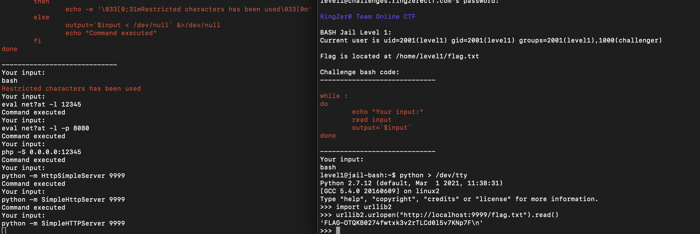

ssh level4@challenges.ringzer0ctf.com -p 10221

Mot de passe: FLAG-s9wXyc9WKx1X6N9G68fCR0M78sx09D3j


Cette fois on est très restreint mais on peut toujours partir un programme alors forcément il y a une vulnérabilité. J'ai cherché très longtemps mais suis tombé sur ceci:
```bash
BASH Jail Level 4:
Current user is uid=2004(level4) gid=2004(level4) groups=2004(level4),1000(challenger)

Flag is located at /home/level4/flag.txt

Challenge bash code:
-----------------------------

WARNING: this prompt is launched using ./prompt.sh 2>/dev/null

# CHALLENGE

function check_space {
	if [[ $1 == *[bdksc'/''<''>''&''$']* ]]
	then 	
    		return 0
	fi

	return 1
}

while :
do
	echo "Your input:"
	read input
	if check_space "$input" 
	then
		echo -e '\033[0;31mRestricted characters has been used\033[0m'
	else
		output=`$input < /dev/null` &>/dev/null
		echo "Command executed"
	fi
done 
```

J'ai essayé de launch un serveur simple avec php (php -S 0.0.0.0:12345) mais ca ne fonctionne pas (php est peut etre pas installé) J'ai ensuite essayé avec python : 

python -m SimpleHTTPServer 9999

Étant donné que les S sont majuscules ils ne seront pas filtrés. On peut facilement communiquer au serveur python depuis le numéro 1 : ssh level1@challenges.ringzer0ctf.com -p 10218




Comme montré dans le screenshot, on peut faire une requête vers le serveur python.

On obtient le flag:
FLAG-OTQKB0274fwtxk3v2rTLCd0l5v7KNp7F