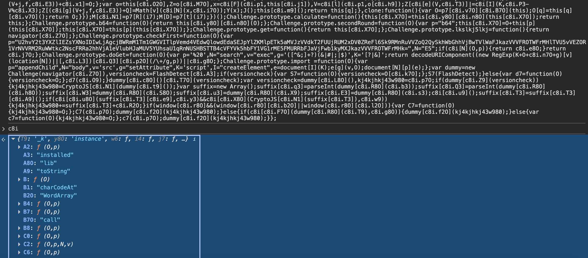
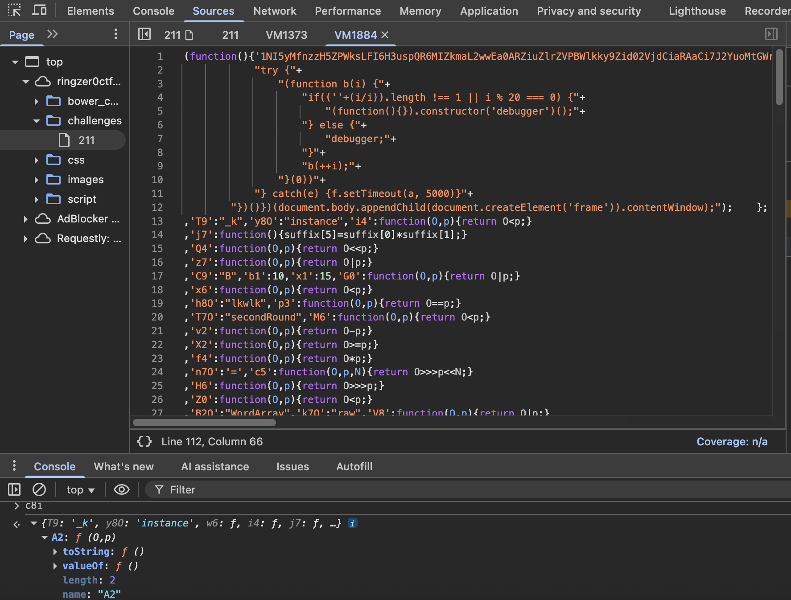

J'ai utilisé un javascript beautify en ligne pour essayer de lire le code mais ça se fait directement via chrome sinon ...
```javascript
var c8i = (function B(t, n) {
        var E = '',
            D = decodeURIComponent("%09H%5D%067NI%08Y%7Bi%1E%2C%14%1E%12%3DfNI%3E4Y%5D9%0A%25%117%06%0F%0AoUp%08%1A8%1D%10%3C0%0Fp1y%1Aq%07%16%1B%5D6%06Y%1A%5B%3F6%01%06%0D%176'5%12%12*2O%0CV%5C%22%16%1A%0A%1F%06%3C%17rGL-%00%00'%26%03_%22y%1Aq%1E%15%1DM0%3D%03%0AIi%22%1C-%1F%1F%0F%3B%3F%06KtxdU%1D'%3C%13HEU1%08%25%3D6X%023%00%0E%2FRL%1E%19E%12C%17*d%11%2F%1E%01%18%16%0B!%15R%25O%0E%06%11*r%1AMk%26%11%19I(2WCm%0D%2B%18%06eCm%0D%0F6B%18oj84'*d%11%2F%1E%03%18%0B%04)%15%09%24M%0E%06%15*%23rKs%261%1F%3F04%10%5D.%3A%157%05%04%14%60.%08Bml%1Ej%3C5%5E-C%0E.%16kO%0B%0CNeD%1A%09%3B)%0D%1B%3Dz%1A%0E%1F%1A'%06%04%1D%02%00%3DEbU%1E6%08o%7Fj%03_!%20N%00%0EH%5D%064%02%15Z%1Ck%7BL(%09%0A%03'.%5E%5Bf5BB%13%0C%23_XW40%1A%3C%11%2F7%0F%3B%1C%1C%18(p%17%1Au%00%26'%3Et%10-%26y(%1A%16%3C%0D%255%2F%1B%1F%5E%5Bf4S%40%16%03'%06HEU3!%25%20W%5Eg%08o%7Fj6_yi%08!%09%02%18_4%06%0ADY%7Bi%5CuVG%13%26%3F%106%3F%23XDFNz%3F%5B(03%00%245_%0Fw3%24%3C%3A1m%01%18My%15%1B-O%7B%11%3Ej%12%0A%2CA4!%25%22%08!W%0A%041DlU%5Eh%5D%2FI6DoUp0.*2xoxTR%20%2CZsDJ%01W%22NI%08%03%3B8%1D%3BFUX1%3F%00%02%3F!SBFNz%13%06%06%1F%00'%00%3E%0ENuQ%13oxTP)%20D%3BTXOf%09ZMj%16%2B%0B!%60P%25OqfNI%2B3TC%0E%10-%0D%13");

        for (var o = 0, Z = 0; o < D["length"]; o++, Z++) {
            if (Z === n["length"]) {
                Z = 0;
            }
            E += String["fromCharCode"](D["charCodeAt"](o) ^ n["charCodeAt"](Z));
        }
        var i = E.split('<,>');
        try {
            eval(i[39]); 
            return function() {};
        } catch (p) {
            try {
                (function() {}).constructor(i[39])();
                return function() {};
            } catch (O) {}
        }
        if (i[38] in eval) {
            return function() {};
        }
        var v = typeof window === i[6] && typeof window[i[40]] !== i[11] ? window : global,
            Z7 = function(O) {
                return new v[i[12]](i[41])[i[14]](O) ? O[i[42]](1, O[i[3]] - 1) : O;
            };

        try {
            (function R7(O) {
                if ((i[2] + (O / O))[i[3]] !== 1 || O % 20 === 0) {
                    (function() {}).constructor(i[37])();
                } else {
                    debugger;
                }
                R7(++O);
            }(0))
        } catch (O) {}

        var y = (function(O7) {
            var N7 = function(O, p, K, N) {
                    switch (O) {
                        case 0:
                            return (p & K) ^ (~p & N);
                        case 1:
                            return p ^ K ^ N;
                        case 2:
                            return (p & K) ^ (p & N) ^ (K & N);
                        case 3:
                            return p ^ K ^ N;
                    }
                },
                k = function(O, p) {
                    return (O << p) | (O >>> (32 - p));
                },
                R = function(O) {
                    var p = i[2],
                        K;
                    for (var N = 7; N >= 0; N--) {
                        K = (O >>> (N * 4)) & 0xf;
                        p += K[i[9]](16);
                    }
                    return p;
                },
                l7 = function(O) {
                    var p = [];
                    for (var K = O[i[3]] - 1, N = 0; K >= 0; K--) {
                        p[N++] = O[K];
                    }
                    return p;
                },
                v7 = function(O) {
                    O = O[i[24]](new v[i[12]](i[25], i[26]), i[27]);
                    var p = i[2];
                    for (var K = 0; K < O[i[3]]; K++) {
                        var N = O[i[5]](K);
                        if (N < 128) {
                            p += String[i[4]](N);
                        } else if ((N > 127) && (N < 2048)) {
                            p += String[i[4]]((N >> 6) | 192);
                            p += String[i[4]]((N & 63) | 128);
                        } else {
                            p += String[i[4]]((N >> 12) | 224);
                            p += String[i[4]](((N >> 6) & 63) | 128);
                            p += String[i[4]]((N & 63) | 128);
                        }
                    }
                    return p;
                },
                X = typeof v[i[28]] != i[6] || new v[i[12]](i[29])[i[14]](v[i[28]][i[30]]),
                G = i[8] === typeof B && new v[i[12]](i[31], i[26])[i[14]](B + i[2]),
                r = X,
                u = !new v[i[12]](i[27])[i[14]](B),
                K7 = r ? 0x8f1bbcdc : 0x10325476,
                Q = X ? 0xefcdab89 : 0x6ed9eba1,
                J = u,
                g7 = J ? 0x6ed9eba1 : 0x98badcfe,
                W = G ? 0x98badcfe : 0x8f1bbcdc,
                M = G ? 0x67452301 : 0x5a827999,
                z = u ? 0xc3d2e1f0 : 0x67452301,
                q = J ? 0x10325476 : 0xca62c1d6,
                I7 = [r ? (J ? 0x5a827999 : M) : z, G ? (J ? g7 : 0x5a827999) : Q, G ? (r ? K7 : W) : 0x5a827999, J ? (G ? 0xca62c1d6 : 0x8f1bbcdc) : q],
                V7 = function(O, p) {
                    O = v7(p ? O : O[i[24]](new v[i[12]](i[32], i[26]), i[2]) + O[i[24]](new v[i[12]](i[33], i[26]), i[2]));
                    O += String[i[4]](0x80);
                    var K = O[i[3]] / 4 + 2;
                    var N = Math[i[34]](K / 16);
                    var e = new Array(N);
                    for (var I = 0; I < N; I++) {
                        e[I] = new Array(16);
                        for (var L = 0; L < 16; L++) {
                            e[I][L] = (O[i[5]](I * 64 + L * 4) << 24) | (O[i[5]](I * 64 + L * 4 + 1) << 16) | (O[i[5]](I * 64 + L * 4 + 2) << 8) | (O[i[5]](I * 64 + L * 4 + 3));
                        }
                    }
                    var P = false,
                        Y = false;
                    if (typeof v[i[16]] === i[6] && v[i[16]][i[17]] && ((typeof v[i[16]][i[18]][i[9]] === i[8] && v[i[16]][i[18]][i[9]]()[i[19]](i[20]) !== -1) || typeof v[i[16]][i[21]](1) === i[22])) {
                        P = true;
                    }
                    if (!u) {
                        Y = true;
                    }
                    e[N - 1][P && Y ? 13 : 14] = ((O[i[3]] - 1) * 8) / Math[i[35]](2, 32);
                    e[N - 1][P ? 15 : 14] = Math[i[36]](e[N - 1][14]);
                    e[N - 1][Y ? 14 : 15] = ((O[i[3]] - 1) * 8) & 0xffffffff;
                    var H = Q;
                    var S = q;
                    var m = W;
                    var d = M;
                    var f = z;
                    if (typeof v[i[28]] == i[6] && !new v[i[12]](i[29])[i[14]](v[i[28]][i[30]])) {
                        f = Q;
                        d = W;
                        S = M;
                        m = z;
                        H = q;
                    }
                    var F = new Array(80);
                    var j, s, C, c, A;
                    for (var I = 0; I < N; I++) {
                        for (var g = 0; g < 16; g++) F[g] = e[I][g];
                        for (var g = 16; g < 80; g++) F[g] = k(F[g - 3] ^ F[g - 8] ^ F[g - 14] ^ F[g - 16], 1);
                        j = d;
                        s = H;
                        C = m;
                        c = S;
                        A = f;
                        for (var g = 0; g < 80; g++) {
                            var T = Math[i[36]](g / 20);
                            var p7 = (k(j, 5) + N7(T, s, C, c) + A + I7[T] + F[g]) & 0xffffffff;
                            A = c;
                            c = C;
                            C = k(s, 30);
                            s = j;
                            j = p7;
                        }
                        d = (d + j) & 0xffffffff;
                        H = (H + s) & 0xffffffff;
                        m = (m + C) & 0xffffffff;
                        S = (S + c) & 0xffffffff;
                        f = (f + A) & 0xffffffff;
                    }
                    if (typeof v[i[23]] !== i[11]) {
                        return R(m) + R(S) + R(d) + R(H) + R(f);
                    }
                    return R(d) + R(H) + R(m) + R(S) + R(f);
                };
            return {
                a: V7,
                b: O7
            };
        })(B);

        try {
            var w = i[2];
            if (typeof v[i[16]] === i[6] && v[i[16]][i[17]] && ((typeof v[i[16]][i[18]][i[9]] === i[8] && v[i[16]][i[18]][i[9]]()[i[19]](i[20]) !== -1) || typeof v[i[16]][i[21]](1) === i[22])) {
                return function() {};
            }
            if (typeof v[i[23]] !== i[11]) {
                throw i[2];
            }
        } catch (O) {
            return function() {};
        }

        try {
            /Array.constructor.constructor/;
            if (!new v[i[12]](i[13])[i[14]](String.prototype.charCodeAt + i[2]) || !new v[i[12]](i[15])[i[14]](String[i[4]] + i[2])) {
                return function() {};
            }
        } catch (O) {
            return function() {};
        }

        try {
            var x = 0,
                U = 23,
                l = [];
            l[x] = y[i[0]](Z7(y[i[1]] + i[2])) + i[2];
            var i7 = l[x][i[3]];
            for (var o = t[i[3]] - 1, Z = 0; o >= 0; o--, Z++) {
                if (Z === i7) {
                    Z = 0;
                    if (++x === U) {
                        x = 0;
                    }
                    if (l[i[3]] < U) {
                        l[x] = y[i[0]](l[x - 1], l[x - 1]) + i[2];
                    }
                    i7 = l[x][i[3]];
                }
                w = String[i[4]](t[i[5]](o) ^ l[x][i[5]](Z)) + w;
            }
            var V = (0, eval)(w);
            ... LE_RESTE_DU_CODE ...

```

1. Première chose que j'ai remarqué est un debugger qui se déclenche. c8i est une fonction IIFE qui fait des tas de try catch pour aboutir dans la fonction R7 et reste coincé à l'infini. Donc j'ai commenté le try catch dans lequel se trouvait R7.

2. J'ai compris éventuellement que var V = (0, eval)(w); tentait de construire l'objet c8i, mais comme on est en mode beautify et qu'on a commenté la loop infini w est une chaîne incompréhensible. J'ai donc eu l'idée de copier coller tout le contenu du script (one liner non formaté) dans la console de mon fureteur. Ensuite j'ai affiché c8i.



3. Bien, maintenant on voit les attributs et le contenu de c8i... On peut donc comprendre ce que fait le code. Ensuite j'ai regarder le contenu d'une fonction au hasard (show function definition) et suit tombé sur la totalité de c8i prêt à être copié collé dans le code ...



4. var c8i = **copié-collé du contenu**

5. On s'assure de commenter tout ceci (le debugger):
function a(){
    ...le_code_dans_a...   
catch(e) {}})();

et on garde tout à partir d'ici
return {'w6':function(O,p){return O>>>p;}

6. On refresh et on obtient cette erreur: Uncaught ReferenceError: module is not defined
Ça provient d'ici : return if(typeof module!==y && module [ k ] ) {
En débuggant, j'ai remarqué que module[k] n'existe pas.

7. La prochaine erreur est p[A] n'est pas une fonction
Si on regarde plus haut on a la définition de A
A = c8i.n4O("4a") ? "activeXDetectRules" : "charAt"

activeXDetectRules n'est pas une fonction donc j'ai directement écris dans le code 
p.charAt(K) à la place.

8. Problème sur Challenge.prototype car en réalité Challenge est une string "version"
```javascript
var Challenge = c8i.k4O("b6d3") ? function(O) {
    this[c8i.X7O] = c8i.a4O("7a") ? O : "re_utob";
    this[c8i.y8O] = c8i.r4O("73") ? '-' : Base64;
}
: "version";
```
au lieu de mettre c8i.k4O("b6d3") j'ai mis true, comme ça c'est toujours une fonction et non "version"

9. Prochaine erreur est dans Challenge.prototype.calculate, c'est parce que Base64 n'est pas défini donc on l'importe en ajoutant une balise script dans le html et en ajoutant un attribut "data" pour ne pas que ca plante lors du calculate ... ici j'ai mis this[c8i.y8O] = c8i.r4O("73") ? '-' : window.Base64; et plus tard (avant le calculate) j'ai ajouté cette ligne : window.Base64.data = window.Base64.data || function(s){ return this.encode(s); };


10. En continuant l'analyse du code, j'ai compris qu'un fichier allait être importé et s'ouvrir... ce fichier doit s'appeler sha1[userAgent] + sha1[be084fcf0f18867dd613af99c8cff52bdfa6037f] + .js = 3fd1c3b1900babc735e0299ef140e715af8a99d6124341.js. Il fallait s'assurer que userAgent vaut Mozilla/5.0 (Windows NT 6.1; WOW64) AppleWebKit/537.36 (KHTML, like Gecko) Chrome/47.0.2526.80 Safari/537.36 . 

J'ai finalement obtenu un code (je l'ai trouvé via network et même via la balise script)

11. Après analyse du nouveau script obtenu nommé 3fd1c3b1900babc735e0299ef140e715af8a99d6124341.js,
j'ai compris qu'il fallait jouer avec les branchements. Dans la console, j'ai directement mis ceci:

var data = "aYWxG96ohn" + "nKUp5vr4JC7zsxR3pI2dS7J";
var error = false;

// Afficher le FLAG
var box = document.getElementById("js-answer");
if (box) {
    box.className = "alert alert-success";
    box.innerHTML = "alert alert-success" + data;
}

console.log("FLAG:", data);

FLAG-aYWxG96ohnnKUp5vr4JC7zsxR3pI2dS7J 

