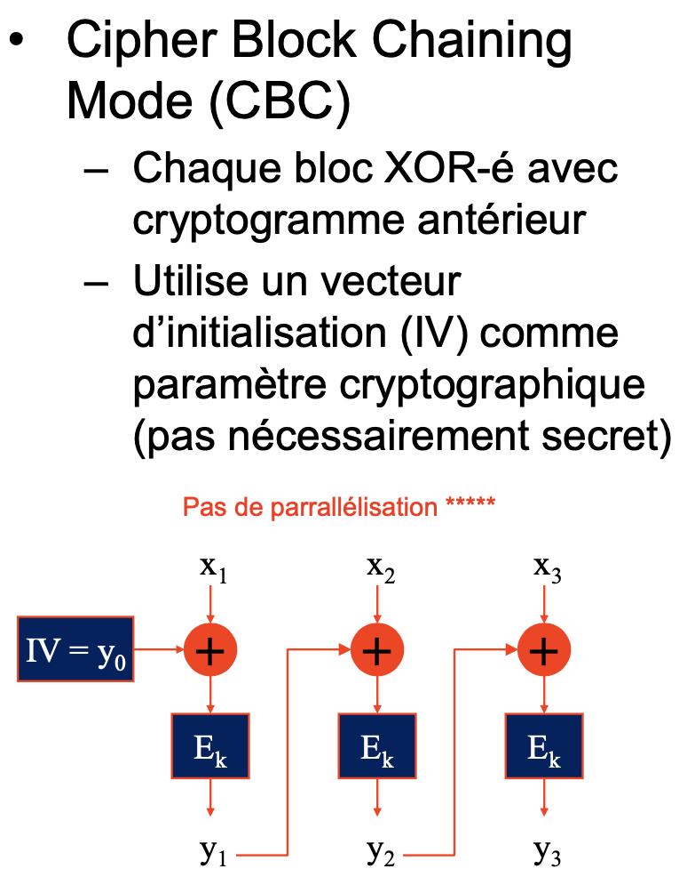

```javascript
$(".c_submit").click(function(event) {
    event.preventDefault();
    var k = CryptoJS.SHA256("\x93\x39\x02\x49\x83\x02\x82\xf3\x23\xf8\xd3\x13\x37");
    var u = $("#cuser").val();
    var p = $("#cpass").val();
    var t = true;

    if(u == "\x68\x34\x78\x30\x72") { // h4x0r
        // Il ne faut pas entrer dans ce if ci dessous
        if(!CryptoJS.AES.encrypt(p, CryptoJS.enc.Hex.parse(k.toString().substring(0,32)), 
                { iv: CryptoJS.enc.Hex.parse(k.toString().substring(32,64)) }) == "ob1xQz5ms9hRkPTx+ZHbVg==") {
            t = false;
        }
    } else {
        $("#cresponse").html("<div class='alert alert-danger'>Wrong password sorry.</div>");
        t = false;
    }
    if(t) {
        if(document.location.href.indexOf("?p=") == -1) {
            document.location = document.location.href + "?p=" + p;
            }
    }
});
```

# Fonctionnement de AES (mode CBC ici vu le vecteur IV)

On fait un xor avec IV (notre vecteur d'initialisation) sur le premier bloc plaintext password. Le résultat est ensuite envoyé dans une encryption AES (algorithme symétrique donc inversible si on connait la clé). La sortie est elle envoyé en entrée du prochain xor avec le prochain bloc plaintext. Le résultat passe ensuite dans AES. Le processus se répète. Sur l'image, les boîtes Ek représente l'algo AES. Comme on a IV et la clé pour l'algorithme AES (la même pour chaque bloc Ek) alors il est facile de retrouver le plaintext. (xor est inversible et AES est un algo symétrique/inversible)


