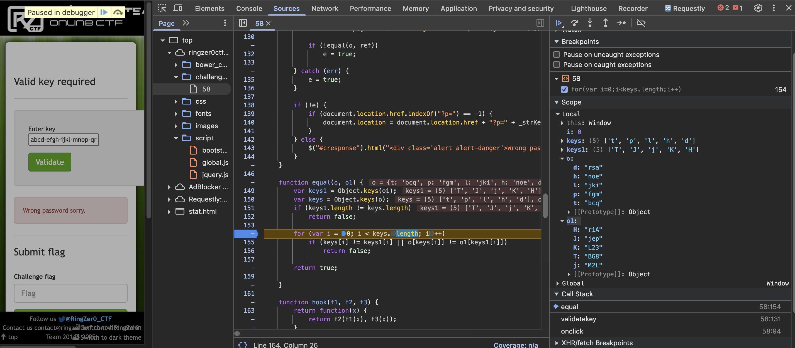

```javascript
function curry( orig_func ) {
	var ap = Array.prototype, args = arguments;
			
	function fn() {
		ap.push.apply( fn.args, arguments ); 
		return fn.args.length < orig_func.length ? fn : orig_func.apply( this, fn.args );
	}
			 
	return function() {
		fn.args = ap.slice.call( args, 1 );
		return fn.apply( this, arguments );
	};
}
		
function callback(x,y,i,a) {
	return !y.call(x, a[a["length"]-1-i].toString().slice(19,21)) ? x : {};
}
		
var ref = {T : "BG8",J : "jep",j : "M2L",K : "L23",H : "r1A"};
		
function validatekey(){
	e = false;
	var _strKey = "";
	try {
		_strKey = document.getElementById("key").value;
		var a = _strKey.split("-");
		if(a.length !== 5)
		    e = true;
		        
		var o=a.map(genFunc).reduceRight(callback, new (genFunc(a[4]))(Function));
		
		if(!equal(o,ref))
			e = true;
				
	}catch(err){
		e = true;
	}

	if(!e) {
		if(document.location.href.indexOf("?p=") == -1) {
			document.location = document.location.href + "?p=" + _strKey;
        }
	} else {
		$("#cresponse").html("<div class='alert alert-danger'>Wrong password sorry.</div>");
	}   
}
		
function equal(o,o1){
	var keys1 = Object.keys(o1);
	var keys = Object.keys(o);
	if(keys1.length != keys.length)
		return false;
		        
	for(var i=0;i<keys.length;i++)
		if(keys[i] != keys1[i] || o[keys[i]] != o1[keys1[i]])
		    return false;
	
	return true;
}
		
function hook(f1,f2,f3) {
	return function(x) { return f2(f1(x),f3(x));};
}
		
var h = curry(hook);
var fn = h(
    function(x) {
        return x >= 48;
    },
    new Function("a","b","return a && b;")
);
function genFunc(_part) {
	if(!_part || !(_part.length) || _part.length !== 4)
		return function() {};
		
	return new Function(_part.substring(1,3), "this." + _part[3] + "=" + _part.slice(1,3) + "+" + (fn(function(y){return y<=57})(_part.charCodeAt(0)) ?  _part[0] : "'"+ _part[0] + "'"));
}
```

Ce qui nous intéresse est 

```javascript
if(!e) {
		if(document.location.href.indexOf("?p=") == -1) {
			document.location = document.location.href + "?p=" + _strKey;
        }
	} else {
		$("#cresponse").html("<div class='alert alert-danger'>Wrong password sorry.</div>");
	}  
```

Pour rentrer dans ce if le e doit être false. Il faut donc entrer une clé valide ... ce qu'on ne sait pas faire.
Cependant, on peut utiliser le javascript debugger sur notre fureteur.



j'ai vu que ça prenait 5 groupes de 4 caractères séparés par des trait d'union.

Or j'ai tenté abcd-efgh-ijkl-mnop-qrst

La comparaison avec la réponse est faite dans la fonction equal

Mon objet o était comme suit

d : bcq

h : fgm

l : jki

p : noe

t : rsa

Le pattern que j'ai reconnu est : 

derniere lettre du groupe : 2e caractère intact, 3e caractère intact, premier caractère du précédent groupe (ou du dernier pour le premier groupe)

Donc pour donner :

T : BG8
J : jep
j : M2L
K : L23
H : r1A

T J j K et H doivent être les dernières lettres

Les dernières lettres 8-p-L-3-A doivent être les premières lettres donc dans le sens inverse:

ABG_-3je_-LM2_-pL2_-8r1_

J'ai tenté ABGT-3jeJ-LM2j-pL2K-8r1H
Ça n'a pas fonctionné donc j'ai tenté d'inverser les dernières lettres:

ABGH-3jeK-LM2j-pL2J-8r1T
Ça fonctionne et on obtient le flag