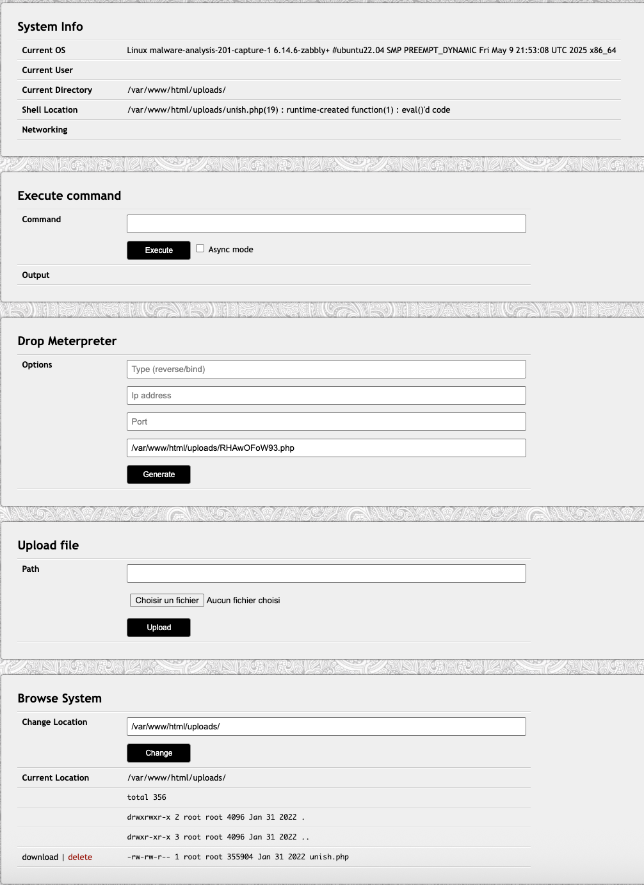

J'ai pas réussi initialement ce problème car je devais commencer par la partie 5.

Je me suis connecté sur le site :
http://challenges.ringzer0ctf.com:10201/uploads/unish.php

J'ai dû faire les requêtes depuis burpsuite puis spécifier comme dans les paquets le user agent:
User-Agent: Mozilla/5.0 (UniShell; Linux x86_64; v.1) UniShell/1,2,3 Agent/1.0

# Site web

La commande whoami me retourne www-data

En cherchant, je suis tombé sur une anomalie dans /etc 

La commande ls -alt /etc me retourne 2 fois le répertoire .. (pour reculer)

Techniquement chaque nom de fichier dans un même répertoire doit être unique donc il doit y avoir un caractère qui est invisible. En cherchant en ligne je suis tombé sur l'option b de ls, et en l'essayant je remarque un dossier .. (sans espace à la fin) et un dossier .. (avec un espace à la fin). Donc les 2 dossiers n'ont donc bel et bien pas le même nom.

On peut ensuite regarder celui avec un espace

ls -altb /etc/..\ 
drwxr-xr-x 68 root root 4096 Jan 31 2022 ..
drwxr-xr-x 2 root root 4096 Jan 31 2022 .
-rw-r--r-- 1 root root 52 Jan 31 2022 sys

sys est un fichier donc on va afficher son contenu

cat /etc/..\ /sys
RkxBRy11NEh2UXR4SFMxSHozaDZBQ21yNWs5VzNLOXNHZGJPWg==

Base64 decode :
FLAG-u4HvQtxHS1Hz3h6ACmr5k9W3K9sGdbOZ