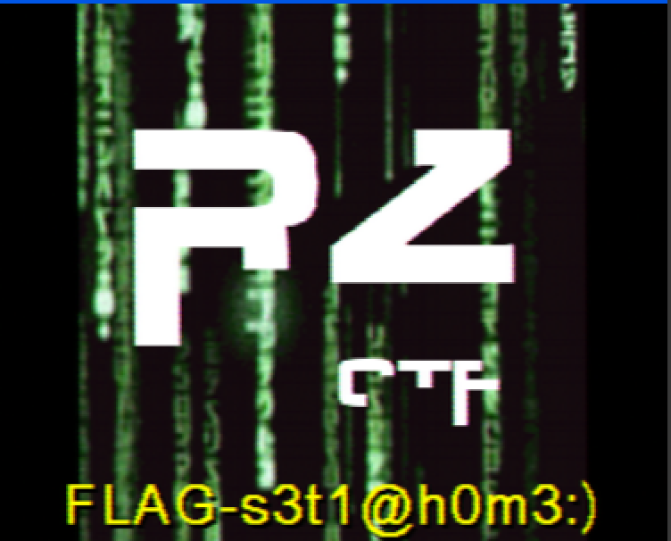

J'ai directement remarqué que c'était un genre de sstv.

Ensuite, j'ai installé qsstv mais c'était hyper compliqué j'ai dû jouer dans le makefile.

Par la suite j'ai installé un micro virtuel appelé blackhole

Pour run le wav dans le micro virtuel, j'ai utilisé la commande

```bash
sox 5daa4d399830386f27b1345b40eb04c59b2ee351 -t coreaudio "BlackHole 2ch"
```
Il faut s'assurer que l'application qsstv écoute en entrée sur BlackHole 2ch


FLAG-s3t1@h0m3:)