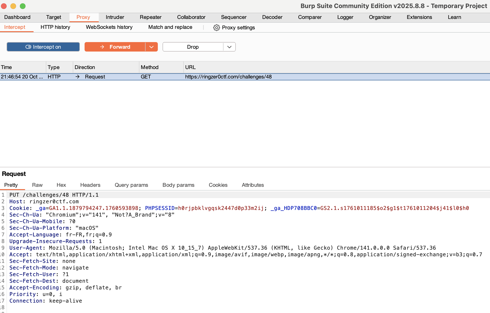

# Recherche

J'ai cherché ce qu'était un fichier .htaccess. C'est un fichier de configuration pour serveur web Apache.
Il contient des règles qui redirige accepte refuse certaines requêtes et même applique des protections par mot de passe quand on tente d'accéder à certaines ressources.

Par la suite j'ai cherché des moyens de bypass ces règles ... et suis tombé sur un lien proposant de changer le type de requête vers PUT en espérant que la gestion des types de requêtes soit mal géré. Via burp suite on modifie la requête par un put.

FLAG-w4KRr557y626izv567758O52