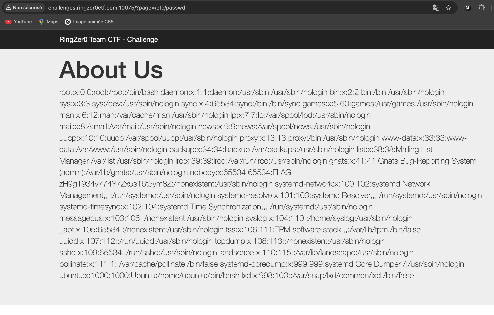

J'ai directement remarqué que l'URL avec un paramètre page=...
J'ai tenté d'exposer un fichier intéressant (en supposant que le serveur est linux) /etc/passwd 

# Info
Le fichier /etc/passwd sur linux contient le nom des utilisateurs pouvant se connecter sur la machine linux et leur uid gid shell par défaut etc ...

x représente un mot de passe. Ce mot de passe est stocké et encrypté dans /etc/shadow. 

FLAG-zH9g1934v774Y7Zx5s16t5ym8Z